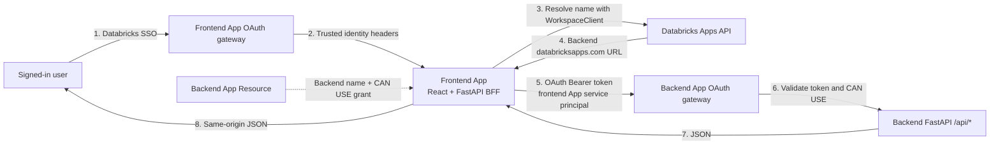
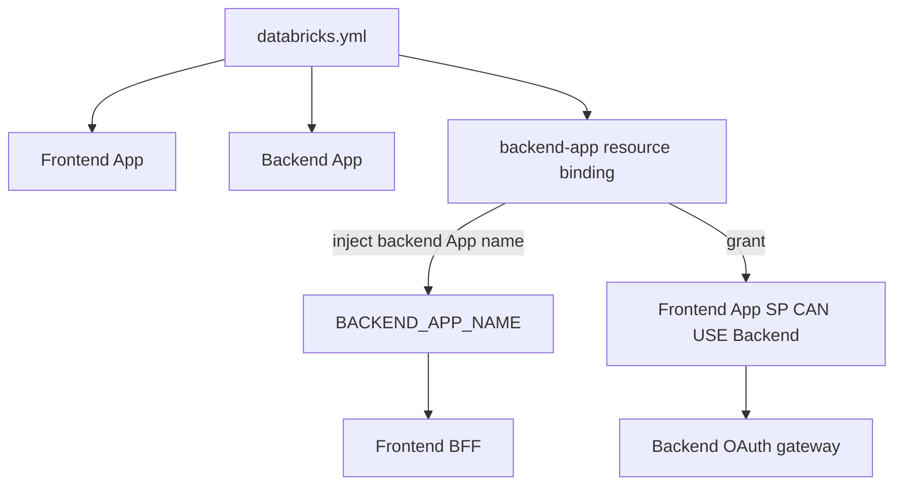
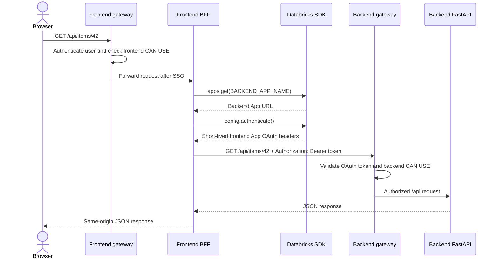
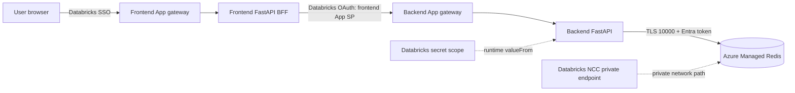

# Once Upon a Runtime

An end-to-end Azure Databricks Apps reference monorepo for a React + TypeScript frontend and FastAPI backend. It demonstrates both supported deployment shapes:

**A production story for Azure Databricks Apps.** **Once Upon a Runtime** follows a full-stack application from local development to secure production deployment: React, FastAPI, Databricks Apps, SSO, app-to-app proxying, GitLab CI/CD and Azure Managed Redis. The technical slug and Bundle name are `once-upon-a-runtime`; generated App names remain within Databricks’ 30-character limit.

1. **Unified app** — one Databricks App runtime; FastAPI serves the built React SPA and the API.
2. **Split apps** — two Databricks App runtimes; a frontend BFF serves React and securely proxies `/api` to a separate FastAPI app.

> Updated and source-checked on **2026-08-01**. Databricks Apps use managed serverless runtimes. They do not deploy a Docker Compose stack or arbitrary customer Docker images. In this guide, “container” means the isolated managed runtime behind one Databricks App.

## Repository map

```text
once-upon-a-runtime/
├── databricks.yml                 # Declarative Automation Bundle: both patterns
├── .gitlab-ci.yml                 # test, security, package, deploy, DAST
├── scenarios/
│   ├── unified/                   # React + FastAPI in one app runtime
│   └── split/
│       ├── frontend/              # React + thin FastAPI BFF/proxy
│       └── backend/               # FastAPI API app
├── scripts/                       # CI deployment and smoke-test helpers
└── docs/
    ├── architecture.md            # HLD, LLD, request flows and trade-offs
    ├── frontend-backend-connectivity.md # Layman guide to CORS and proxying
    ├── authentication.md          # SSO, user auth and app auth
    ├── azure-managed-redis.md     # Redis identity, secrets, networking and code
    ├── cicd.md                    # GitLab setup and promotion model
    ├── configuration.md           # databricks.yml vs app.yaml
    └── operations.md              # networking, telemetry and troubleshooting
```

## Fast decision

| Need | Choose |
|---|---|
| Small/medium product, atomic releases, lowest latency | Unified |
| Independent scaling/ownership/releases or reusable API | Split |
| Browser directly calls a second app URL | Avoid; use the frontend BFF proxy |
| Public/anonymous application | Databricks Apps is not suitable; SSO cannot be bypassed |

## Prerequisites

- Azure Databricks workspace with Apps enabled and a workspace URL such as `https://adb-...azuredatabricks.net`.
- Databricks CLI supporting app resources in Bundles (use a current release; app Bundle resources were introduced in CLI 0.239.0).
- Node.js 20+, npm 10+, Python 3.11+.
- For production CI: a Databricks service principal using OAuth M2M, with workspace access and least-privilege app management permissions.
- A Linux/amd64 GitLab Runner with Docker or Kubernetes executor for GitLab security analyzers. DAST and dependency vulnerability reporting require the applicable GitLab tier; see [CI/CD guide](docs/cicd.md).

## Editor setup and red-line checks

Open the repository root—not an individual scenario folder—in VS Code. Install the recommended extensions when prompted, then prepare one Python environment containing all monorepo development dependencies:

```bash
python -m venv .venv
. .venv/bin/activate
pip install -r requirements-dev.txt
npm --prefix scenarios/unified ci
npm --prefix scenarios/split/frontend ci
mkdir -p .databricks
databricks bundle schema > .databricks/bundle-schema.json
```

On PowerShell, activate with `.venv\Scripts\Activate.ps1` and generate the schema with:

```powershell
New-Item -ItemType Directory -Force .databricks | Out-Null
databricks bundle schema | Out-File -Encoding utf8 .databricks/bundle-schema.json
```

Select the root `.venv` as the VS Code Python interpreter and reload the window. The committed `pyrightconfig.json`, scenario `tsconfig.json` files and `.vscode/settings.json` define the correct monorepo import roots. Run the same diagnostics outside the editor with:

```bash
pyright
ruff check scenarios
npm --prefix scenarios/unified run typecheck
npm --prefix scenarios/split/frontend run typecheck
```

## Run locally

Unified:

```bash
cd scenarios/unified
npm ci
npm run build
python -m venv .venv
. .venv/bin/activate
pip install -r requirements.txt
uvicorn server.main:app --reload --port 8000
```

Open `http://localhost:8000`. The unified API is `http://localhost:8000/api/hello`.

Split (two terminals):

```bash
cd scenarios/split/backend
python -m venv .venv && . .venv/bin/activate
pip install -r requirements.txt
uvicorn app.main:app --reload --port 8001
```

```bash
cd scenarios/split/frontend
npm ci && npm run build
python -m venv .venv && . .venv/bin/activate
pip install -r requirements.txt
BACKEND_BASE_URL=http://localhost:8001 uvicorn proxy:app --reload --port 8000
```

PowerShell activation is `.venv\Scripts\Activate.ps1`; set the local variable with `$env:BACKEND_BASE_URL='http://localhost:8001'`.

## Deploy with Bundles

Authenticate interactively for development:

```bash
databricks auth login --host https://<workspace-url> --profile launchpad-dev
```

Validate and deploy resources, then start the chosen apps:

```bash
databricks bundle validate -t dev --profile launchpad-dev
databricks bundle deploy -t dev --profile launchpad-dev
databricks bundle run unified_app -t dev --profile launchpad-dev
# or, backend first:
databricks bundle run split_backend -t dev --profile launchpad-dev
databricks bundle run split_frontend -t dev --profile launchpad-dev
```

`bundle deploy` creates/updates workspace resources and uploads source. `bundle run <app-key>` deploys the source to app compute and starts it. The GitLab jobs use the same sequence. Retrieve URLs with `databricks bundle summary -t dev`.

## SSO in one paragraph

Do not build a second Entra login page in React. A visit to a `*.databricksapps.com` URL enters the Databricks OAuth/SSO gateway before reaching your code. The gateway enforces `CAN USE` and passes trusted identity headers such as `X-Forwarded-Email`. With user authorization enabled, it also passes `X-Forwarded-Access-Token`; the backend may use that token on behalf of the user, subject to configured OAuth scopes and Unity Catalog permissions. Never expose that token to JavaScript, store it, or log it. See [authentication.md](docs/authentication.md).

For the split-App problem, start with **[How the frontend connects to the backend: CORS, proxy and authentication](docs/frontend-backend-connectivity.md)**. It explains the complete request path in non-specialist language and includes direct-call and recommended proxy code.

## Frontend-to-backend routing: CORS, proxy and dynamic routes

When frontend and backend are separate Databricks Apps, they receive different hostnames. The browser therefore considers them different origins. Calling the backend hostname directly from React creates both a CORS problem and a second Databricks authentication boundary.

### Databricks App-to-App OAuth architecture



Each Databricks App has a different security identity and gateway. The browser authenticates to the frontend through Databricks SSO. The frontend BFF makes a new server-to-server request to the backend using the frontend App’s automatically created service principal. The backend gateway accepts the call only when the OAuth token is valid and that principal has `CAN USE`.

The App Resource declared in `databricks.yml` creates this relationship:



Runtime sequence:



The default implementation uses `PROXY_AUTH_MODE=app`. The OAuth credential remains inside the frontend server process and is never returned to React, stored in browser storage, committed to Git, or copied into `app.yaml`.

For operations that must preserve Unity Catalog permissions of the signed-in user, optional `PROXY_AUTH_MODE=user` forwards the gateway-provided user access token server-side. That mode additionally requires user authorization scopes and the user’s `CAN USE` permission on the backend:

```text
app mode:  Frontend App SP → backend CAN USE → shared backend identity
user mode: Signed-in user  → backend CAN USE → per-user downstream permissions
```

Avoid this browser flow:

```text
React in frontend App
  → https://backend-app...databricksapps.com/api/items/42
  → CORS preflight, backend SSO redirect, cookie/token and CAN USE problems
```

Use the same-origin frontend proxy:

```text
Browser
  → frontend App /api/items/42
  → server-side authenticated proxy
  → backend App /api/items/42
```

React always calls a relative URL rooted with `/`:

```ts
const itemId = 42;
const response = await fetch(
  `/api/items/${encodeURIComponent(String(itemId))}`,
  { credentials: "same-origin" },
);
```

Do not use `fetch("api/items/42")` without the leading slash. From a React page such as `/projects/7`, the browser can incorrectly request `/projects/api/items/42`.

### Case 1: dynamic backend API routes

The backend declares dynamic routes normally:

```python
@app.get("/api/items/{item_id}")
def item(item_id: int):
    return {"id": item_id, "name": f"Item {item_id}"}
```

The frontend BFF uses a path catch-all instead of defining one proxy method per endpoint:

```python
@app.api_route(
    "/api/{path:path}",
    methods=["GET", "POST", "PUT", "PATCH", "DELETE"],
)
async def proxy(path: str, request: Request):
    # /api/items/42 produces path == "items/42"
    target = f"{backend_url()}/api/{path}"
```

The implemented proxy preserves:

- Nested dynamic paths
- HTTP method
- Query parameters
- Request body
- `Content-Type` and `Accept`
- Request ID
- Server-side OAuth authentication

It returns controlled `502` and `504` responses when the backend is unavailable or times out.

### Case 2: React dynamic pages and refresh

A route such as `/projects/42` can work while navigating inside React but fail with 404 after browser refresh. On refresh, the browser asks FastAPI for a physical `/projects/42` resource. The server must return the React entry page for non-API routes:

```python
@app.get("/{path:path}", include_in_schema=False)
def spa(path: str) -> FileResponse:
    candidate = (STATIC / path).resolve()
    if path and candidate.is_relative_to(STATIC.resolve()) and candidate.is_file():
        return FileResponse(candidate)
    return FileResponse(STATIC / "index.html")
```

Register routes in this order:

```text
1. /api/{path:path}  → FastAPI handler or backend proxy
2. /assets/...       → compiled JavaScript and CSS
3. /{path:path}      → React index.html fallback
```

If the SPA catch-all captures `/api/items/42`, the API can return HTML instead of JSON. React will often report:

```text
Unexpected token '<'
```

### Quick routing diagnosis

| Symptom | Cause | Resolution |
|---|---|---|
| CORS error calling backend hostname | Browser is bypassing the BFF | Call relative frontend `/api/...` |
| Dynamic API is 404 | Proxy supports only fixed paths or drops nested path | Use `/api/{path:path}` |
| Request becomes `/projects/api/items/42` | Missing leading `/` in `fetch` | Use `fetch('/api/items/42')` |
| API response starts with HTML | SPA fallback captured the API route | Register `/api` before `/{path:path}` |
| React page works through links but refresh returns 404 | Missing SPA fallback | Return `static/index.html` for non-API paths |
| Proxy returns 401 | Missing/invalid app or user OAuth token | Verify proxy authentication mode |
| Backend returns 403 | Caller lacks `CAN USE`, scopes or downstream permissions | Check each permission layer separately |
| Proxy returns 502/504 | Backend unavailable, unresolved or timed out | Check backend status, App Resource and networking |

CORS headers alone do not authenticate the backend, grant `CAN USE`, or make the frontend App’s browser cookie valid for the backend hostname. The complete explanation is in [frontend-backend-connectivity.md](docs/frontend-backend-connectivity.md).

## Split Apps with Azure Managed Redis

The complete production path is:



For a new 2026 deployment, use **Azure Managed Redis**. Azure Cache for Redis is on a published retirement path. The backend example uses Microsoft Entra authentication rather than a Redis access key.

Four values are stored in an environment-specific Databricks secret scope:

```text
redis-host
redis-tenant-id
redis-client-id
redis-client-secret
```

Create scopes and values before deploying:

```bash
databricks secrets create-scope once-upon-runtime-dev
databricks secrets put-secret once-upon-runtime-dev redis-host
databricks secrets put-secret once-upon-runtime-dev redis-tenant-id
databricks secrets put-secret once-upon-runtime-dev redis-client-id
databricks secrets put-secret once-upon-runtime-dev redis-client-secret
```

Repeat with a separate `once-upon-runtime-prod` scope and a separate production Redis service principal. The Bundle attaches only that scope to the backend App and `app.yaml` maps resource keys into runtime variables using `valueFrom`. React and the frontend App receive no Redis credential.

The Redis endpoints are available through the normal frontend proxy:

```text
PUT /api/cache/demo   {"value":"hello","ttl_seconds":300}
GET /api/cache/demo
```

The backend prefixes keys with `runtime:`, validates key names, enforces a TTL, uses TLS, obtains renewable Entra tokens through `redis-entraid`, and returns `503` rather than leaking Redis errors.

Read **[Azure Managed Redis from Databricks Apps](docs/azure-managed-redis.md)** for Azure provisioning, service-principal roles, NCC/Private Link, complete YAML, code behavior, rotation and troubleshooting.

## Essential upstream references

- [Databricks Apps deployment and mixed Node/Python build logic](https://learn.microsoft.com/en-us/azure/databricks/dev-tools/databricks-apps/deploy)
- [Manage Apps with Declarative Automation Bundles](https://learn.microsoft.com/en-us/azure/databricks/dev-tools/bundles/apps-tutorial)
- [Configure `app.yaml`](https://learn.microsoft.com/en-us/azure/databricks/dev-tools/databricks-apps/app-runtime)
- [Databricks Apps environment](https://learn.microsoft.com/en-us/azure/databricks/dev-tools/databricks-apps/system-env)
- [Authentication and authorization](https://learn.microsoft.com/en-us/azure/databricks/dev-tools/databricks-apps/auth)
- [App permissions](https://learn.microsoft.com/en-us/azure/databricks/dev-tools/databricks-apps/permissions)
- [App-to-app resources](https://learn.microsoft.com/en-us/azure/databricks/dev-tools/databricks-apps/apps-resource)
- [HTTP identity headers](https://learn.microsoft.com/en-us/azure/databricks/dev-tools/databricks-apps/http-headers)
- [Apps networking](https://learn.microsoft.com/en-us/azure/databricks/dev-tools/databricks-apps/networking)
- [Azure Managed Redis Python and Entra authentication](https://learn.microsoft.com/en-us/azure/redis/python-get-started)
- [Secure Azure Managed Redis](https://learn.microsoft.com/en-us/azure/redis/secure-azure-managed-redis)
- [GitLab SAST](https://docs.gitlab.com/user/application_security/sast/), [dependency scanning](https://docs.gitlab.com/user/application_security/dependency_scanning/), [container scanning](https://docs.gitlab.com/user/application_security/container_scanning/), and [DAST](https://docs.gitlab.com/user/application_security/dast/)
