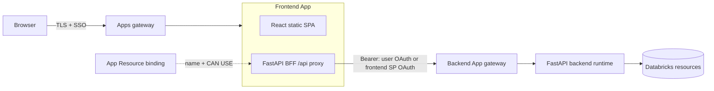
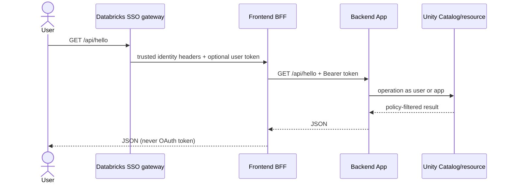

# Architecture: HLD and LLD

## Platform boundary

Azure Databricks places every App in managed serverless compute. The first request is authenticated through the control plane; subsequent traffic is routed to the serverless compute plane. Each app listens on the injected `DATABRICKS_APP_PORT` (FastAPI/Uvicorn host and port variables are supplied automatically), has ephemeral local storage, and receives a unique service principal.

## Unified pattern — HLD

```mermaid
flowchart LR
  U[Browser] -->|TLS + Databricks SSO| G[Databricks Apps gateway]
  G -->|identity headers| A[One managed App runtime]
  subgraph A[One managed App runtime]
    F[FastAPI / Uvicorn]
    R[React static files]
    API[/api routes]
    F --> R
    F --> API
  end
  API -->|user or app OAuth| D[(SQL / UC / Jobs / Models)]
```

Request flow: browser requests `/`; gateway authenticates; FastAPI returns `static/index.html`; React calls relative `/api/hello`; the same FastAPI process handles it. There is no CORS and no token in browser code.

### Unified LLD

- Databricks detects root `package.json`, runs `npm install`, then `npm run build`; Vite writes to `static/`.
- It installs `requirements.txt` and runs `uvicorn server.main:app` from `app.yaml`.
- Route order matters: `/api/*` is registered before the SPA fallback.
- One deployment is atomic. Frontend and backend share CPU/memory, failure domain, logs and release cadence.

## Split pattern — HLD



The browser calls only the frontend origin. The server-side BFF resolves `BACKEND_APP_NAME` through `WorkspaceClient().apps.get`, obtains the target URL, and authenticates the app-to-app hop. This avoids CORS, browser token handling, leaking internal topology, and preflight failures.

### Split LLD



Two proxy modes are implemented:

- `PROXY_AUTH_MODE=app` (default): authenticates through the frontend App’s injected service principal. The App Resource grants it `CAN USE` on the backend. Use for shared service behavior; data access then reflects the app principal, not the end user.
- `PROXY_AUTH_MODE=user`: forwards the gateway-provided user access token as `Authorization`. Enable user authorization/scopes and grant each user `CAN USE` on the backend. This preserves per-user Unity Catalog policy evaluation. Because user authorization is preview and a cross-App token adds another authorization boundary, validate this mode in your workspace; use app auth plus explicit business authorization if cross-App user delegation is not enabled.

## Trade-off matrix

| Dimension | Unified | Split |
|---|---|---|
| Deployments | One atomic | Backend first, frontend second |
| Network hop | None for API | One authenticated app hop |
| Browser origin | One | One, because BFF proxies |
| Scaling and ownership | Coupled | Independent |
| Failure blast radius | Shared | Isolated, but frontend depends on API |
| Authentication | One gateway | Two gateway checks plus token strategy |
| Best default | Yes | Only when separation has real value |

## Reliability practices

- Deploy backend before frontend; keep API changes backward compatible across a release window.
- Give every app `/api/health`; add timeouts, bounded retries only for idempotent requests, and circuit-breaking for mature systems.
- Do not persist state on local disk. Use Unity Catalog tables/volumes or Lakebase depending on workload.
- Propagate `X-Request-Id`, use structured logs, and redact authorization/cookie headers.
- Prefer same-region resources and keep response payloads bounded.
