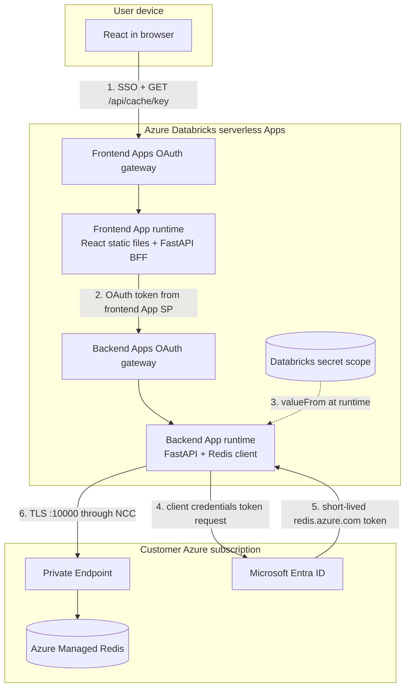
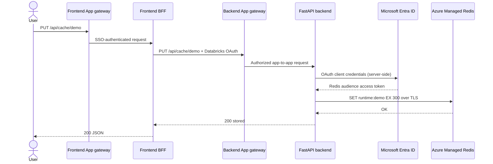

# Azure Managed Redis from split Databricks Apps

This chapter explains how a React frontend in one Databricks App reaches a FastAPI backend in another App, and how only that backend reaches Azure Managed Redis.

## Product choice in 2026

Use **Azure Managed Redis** for a new deployment. Microsoft has announced retirement of all Azure Cache for Redis SKUs. Enterprise creation is already blocked, and the published dates for Basic/Standard/Premium include creation restrictions during 2026 and final retirement in 2028. Existing-cache migration is a separate project; do not copy legacy port 6380 examples into a new Azure Managed Redis design.

Azure Managed Redis uses:

- TLS endpoint: `<cache-name>.<region>.redis.azure.net`
- Port: `10000`
- Microsoft Entra authentication enabled by default
- Private Link as the recommended network boundary

## End-to-end HLD



Important trust boundary: the browser never connects to Redis and never receives a Redis hostname, client secret or token. The frontend App also does not need Redis access. Only the backend process receives Redis configuration.

## LLD request sequence



The Redis credential provider refreshes the Entra access token. The application must not cache bearer tokens itself.

## The service principals and what each one does

There are multiple identities. Combining them mentally is a common source of over-permissioning.

| Identity | Lives in | Used for | Must not be used for |
|---|---|---|---|
| Signed-in user | Entra/Databricks account | Enter frontend through SSO; optional per-user data authorization | Redis infrastructure credential |
| Frontend App service principal | Created automatically per Databricks App | Call backend App; receives `CAN USE` through App Resource | Direct Redis access |
| Backend App service principal | Created automatically per Databricks App | Read its Databricks secret scope and access bound Databricks resources | Automatically assumed to be an Azure Redis identity |
| Redis Entra service principal | Created in the customer Entra tenant | Obtain `https://redis.azure.com/.default` tokens and access Redis keys | Deploy Databricks resources |
| GitLab CI Databricks service principal | Databricks/CI | Validate and deploy Bundles | Runtime application or Redis traffic |
| Optional Azure IaC CI identity | Entra/Azure | Provision Redis, private endpoints and Redis access assignments | Application requests |

The Databricks App service principal and an Entra application identity are not automatically interchangeable. `DATABRICKS_CLIENT_ID` authenticates the App to Databricks APIs. It must not be treated as permission to request an Azure Redis token. This example gives the backend a dedicated Entra Redis client identity through protected secret bindings.

For production, create distinct Redis identities for development and production. Add each service principal under Azure Managed Redis **Authentication → Microsoft Entra Authentication**. Restrict it to the application key namespace where custom access policies are available, for example:

```text
+@read +@write ~runtime:*
```

Avoid administrative and destructive commands such as `FLUSHALL`. Custom per-user access strings are currently preview; confirm organizational acceptance before depending on them. Without a custom policy, added principals can receive broad Redis data access.

## Secret ownership and flow

```mermaid
flowchart LR
  Admin[Platform administrator] -->|one-time/rotation write| Scope[Databricks secret scope]
  Scope -->|READ grant from App Resource| BSP[Backend App SP]
  BSP -->|valueFrom during runtime injection| Env[Backend process environment]
  Env --> DAC[DefaultAzureCredential]
  DAC -->|client credentials| Entra[Entra token endpoint]
  Entra -->|short-lived token| Redis[(Managed Redis)]
```



Rules:

- Use separate scopes such as `once-upon-runtime-dev` and `once-upon-runtime-prod` because Databricks secret permissions apply at scope level.
- Put only backend Redis values in those scopes.
- Grant the backend App `READ`, never `WRITE` or `MANAGE`.
- Never place secret values under `value:` in `app.yaml` or as Bundle variables.
- Never use `VITE_*` for secrets; Vite embeds those values into browser JavaScript.
- Never print the environment, credential objects, connection URLs or tokens.
- Rotation: add a new Entra credential, update the Databricks secret, redeploy/restart the backend, verify, and then remove the old credential.

The hostname and client ID are not passwords, but keeping all four connection-identity values in the backend-only scope provides one controlled configuration mechanism. A more mature organization can manage secret-scope writes from Azure Key Vault-backed processes or approved secret automation.

## Bundle YAML

The root `databricks.yml` declares four secret resources on the backend only:

```yaml
variables:
  redis_secret_scope:
    default: once-upon-runtime-dev

resources:
  apps:
    split_backend:
      name: ${var.app_prefix}-api
      source_code_path: ./scenarios/split/backend
      resources:
        - name: redis-host
          secret:
            scope: ${var.redis_secret_scope}
            key: redis-host
            permission: READ
        - name: redis-tenant-id
          secret:
            scope: ${var.redis_secret_scope}
            key: redis-tenant-id
            permission: READ
        - name: redis-client-id
          secret:
            scope: ${var.redis_secret_scope}
            key: redis-client-id
            permission: READ
        - name: redis-client-secret
          secret:
            scope: ${var.redis_secret_scope}
            key: redis-client-secret
            permission: READ

targets:
  dev:
    variables:
      redis_secret_scope: once-upon-runtime-dev
  prod:
    variables:
      redis_secret_scope: once-upon-runtime-prod
```

This is infrastructure/application binding metadata. It identifies which secret keys the backend App may read; it does not contain the values.

## Backend `app.yaml`

The backend source directory maps the resource keys into the names expected by Azure Identity and the Redis code:

```yaml
command: ["uvicorn", "app.main:app"]
env:
  - name: REDIS_HOST
    valueFrom: redis-host
  - name: AZURE_TENANT_ID
    valueFrom: redis-tenant-id
  - name: AZURE_CLIENT_ID
    valueFrom: redis-client-id
  - name: AZURE_CLIENT_SECRET
    valueFrom: redis-client-secret
  - name: REDIS_PORT
    value: "10000"
  - name: REDIS_KEY_PREFIX
    value: "runtime:"
  - name: REDIS_DEFAULT_TTL_SECONDS
    value: "300"
```

`valueFrom` means “resolve the bound resource at runtime.” `value` is used only for non-sensitive constants.

## Redis Python code

The backend uses Microsoft’s documented credential-provider pattern:

```python
provider = create_from_default_azure_credential(
    ("https://redis.azure.com/.default",),
)

client = redis.Redis(
    host=os.environ["REDIS_HOST"],
    port=10000,
    ssl=True,
    decode_responses=True,
    credential_provider=provider,
    socket_connect_timeout=5,
    socket_timeout=5,
)
```

`DefaultAzureCredential` sees the injected `AZURE_TENANT_ID`, `AZURE_CLIENT_ID`, and `AZURE_CLIENT_SECRET`, requests a token for the Redis audience, and `redis-entraid` handles credential renewal. The cached Python client owns a thread-safe connection pool; it is not a single raw socket.

The example endpoints are:

```bash
curl -X PUT "https://<frontend-app>/api/cache/demo" \
  -H "Content-Type: application/json" \
  -d '{"value":"hello","ttl_seconds":300}'

curl "https://<frontend-app>/api/cache/demo"
```

Use Redis as a cache, session/idempotency store or rate-limit primitive—not as the authoritative database. All sample keys have a TTL. Do not cache raw Databricks OAuth tokens or highly sensitive data.

## Network path: Databricks serverless to private Redis

Databricks Apps run in the serverless compute plane, not inside your workspace VNet. Merely creating a private endpoint in an arbitrary application subnet does not make it reachable from Apps.

Production sequence:

1. Create Azure Managed Redis in the same Azure region as the Databricks workspace when possible.
2. Create a Databricks Network Connectivity Configuration (NCC) in that region and attach it to the workspace.
3. Create an NCC managed private endpoint rule targeting the Redis ARM resource:

   ```text
   /subscriptions/<sub>/resourceGroups/<rg>/providers/Microsoft.Cache/redisEnterprise/<cache>
   ```

   Use private-link group ID `redisEnterprise`.
4. Approve the generated private endpoint connection on the Azure Managed Redis resource.
5. Verify private DNS resolves the normal TLS hostname `<cache>.<region>.redis.azure.net`. Do not configure the application with the `privatelink` hostname.
6. Disable Redis public network access after private connectivity is verified.
7. If Databricks network policies restrict egress, allow the required Redis destination and package registries needed during build.

NCC private endpoint capabilities and supported resources evolve. Confirm Redis private-endpoint support in the target region/workspace before disabling public access. Use the Apps networking denial table `system.access.outbound_network` to diagnose blocked egress.

For an initial non-production test only, a public Redis endpoint with firewall/network restrictions can prove application authentication. Do not confuse that temporary path with the recommended production topology.

## Provisioning checklist

1. Create dev and prod Azure Managed Redis instances.
2. Create separate Entra service principals for dev and prod runtime access.
3. Add those principals to their matching Redis instance and configure least-privilege data access.
4. Prove TLS/Entra connectivity from an approved Azure test client.
5. Create and attach the Databricks NCC; create and approve the Redis private endpoint.
6. Create the two Databricks secret scopes and populate the four keys.
7. Set the hostname to the normal Redis TLS FQDN, with no `https://` prefix and no port.
8. Run `databricks bundle validate`, `bundle deploy`, then start backend before frontend.
9. Test `/api/health`, then `PUT` and `GET` through the frontend URL.
10. Disable public Redis access, rerun tests, and configure monitoring/alerts.

## Failure diagnosis

| Symptom | Layer | Check |
|---|---|---|
| `REDIS_HOST` missing | Databricks resource binding | Secret exists; resource key and `valueFrom` match |
| DNS failure or connect timeout | NCC/private DNS/network policy | NCC attached, endpoint approved, normal Redis hostname used |
| Connection refused/wrong protocol | Client configuration | Azure Managed Redis uses TLS and port 10000 |
| Entra authentication failure | Redis identity | Tenant/client/secret, Redis user assignment, token audience |
| Redis `NOPERM` | Redis ACL | Command category and `runtime:*` key pattern |
| Backend returns 503 | Redis dependency | Inspect redacted backend logs and Azure Redis metrics |
| Frontend returns 502/504 | App-to-app/backend | Backend health, App Resource `CAN USE`, proxy timeout |
| Works locally but not in Apps | Runtime identity/network | Local Azure CLI credential hid missing App secrets or NCC |

## Monitoring and resilience

- Azure Monitor: authentication failures, connections, server load, memory, evictions, latency and errors.
- Databricks App logs: operation, duration, result and request ID; never key values or secrets.
- Set TTLs and memory-eviction policy intentionally.
- Treat a cache miss as normal. Decide whether Redis failure should fail closed, fail open, or fall back to the authoritative store for each endpoint.
- Use bounded timeouts. Retry only safe/idempotent commands and apply jitter.
- For sensitive values, apply application-level encryption before caching or do not cache them.

Primary references: [Azure Managed Redis Python quickstart](https://learn.microsoft.com/en-us/azure/redis/python-get-started), [Managed Redis security](https://learn.microsoft.com/en-us/azure/redis/secure-azure-managed-redis), [Managed Redis Private Link](https://learn.microsoft.com/en-us/azure/redis/private-link), [custom Redis data access](https://learn.microsoft.com/en-us/azure/redis/configure-access-permissions), [Databricks App secrets](https://learn.microsoft.com/en-us/azure/databricks/dev-tools/databricks-apps/secrets), [Apps networking](https://learn.microsoft.com/en-us/azure/databricks/dev-tools/databricks-apps/networking), and [Databricks serverless private connectivity](https://learn.microsoft.com/en-us/azure/databricks/security/network/serverless-network-security/serverless-private-link).
