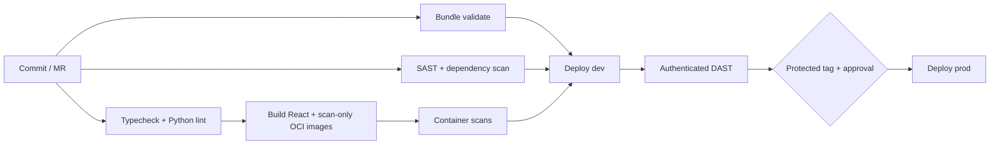

# GitLab CI/CD and security

## Pipeline flow

The Dockerfiles exist for local parity and container vulnerability scanning. Databricks Apps does **not** pull these images; the Bundle uploads source and Databricks performs the managed build.

## Runner and tier requirements

- Use a Linux/amd64 Docker or Kubernetes runner for GitLab analyzers; Windows runners are not supported for SAST analyzers.
- SAST and container scanning have features available across GitLab tiers, but vulnerability UI/report features vary.
- GitLab Dependency Scanning and GitLab DAST require Ultimate under current GitLab documentation. If unavailable, keep SBOM generation and substitute approved scanners (for example, OWASP Dependency-Check/Trivy and ZAP) according to organization policy.
- Docker-in-Docker requires a privileged runner. Prefer a Kubernetes executor or rootless/daemonless builder where organizational policy requires it.

## Required GitLab variables

| Variable | Protection | Meaning |
|---|---|---|
| `DATABRICKS_HOST` | protected | Azure Databricks workspace URL |
| `DATABRICKS_CLIENT_ID` | protected | CI service principal OAuth client ID |
| `DATABRICKS_CLIENT_SECRET` | masked + protected | CI service principal secret |
| `DAST_WEBSITE` | protected | Deployed dev frontend or unified app URL |

The pipeline gets a short-lived M2M token inside the DAST job and puts it only in the analyzer process environment. Grant the CI principal `CAN USE` on the scanned dev App. Never store a token in a dotenv artifact.

## Promotion and rollback

- Merge requests run validation, tests and static/security scans.
- Default branch deploys dev, backend before frontend, then DAST.
- A protected immutable tag exposes the manual production deployment.
- Prefer deployment from the exact commit SHA for auditable releases. GitLab-triggered Bundle deployment is used because Databricks automatic Git deployment currently supports GitHub/Azure DevOps webhooks, not GitLab auto-deploy.
- Roll back by creating a new protected tag pointing at the last approved commit and running the production job. Avoid mutable branch rollback.

## Important CI adjustment

Install the current standalone Databricks CLI using the official setup script. Do not install the legacy `databricks-cli` Python package. In a hardened runner image, preinstall and pin the standalone CLI release and verify its checksum instead of downloading it during every job.

References: [GitLab SAST](https://docs.gitlab.com/user/application_security/sast/), [dependency scanning](https://docs.gitlab.com/user/application_security/dependency_scanning/), [container scanning](https://docs.gitlab.com/user/application_security/container_scanning/), [DAST](https://docs.gitlab.com/user/application_security/dast/), and [Databricks service principals for CI/CD](https://learn.microsoft.com/en-us/azure/databricks/dev-tools/auth/oauth-m2m).
