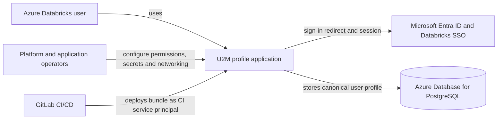
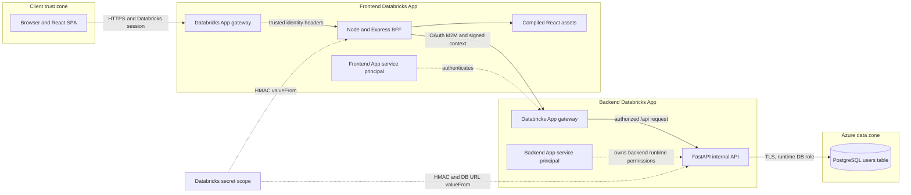
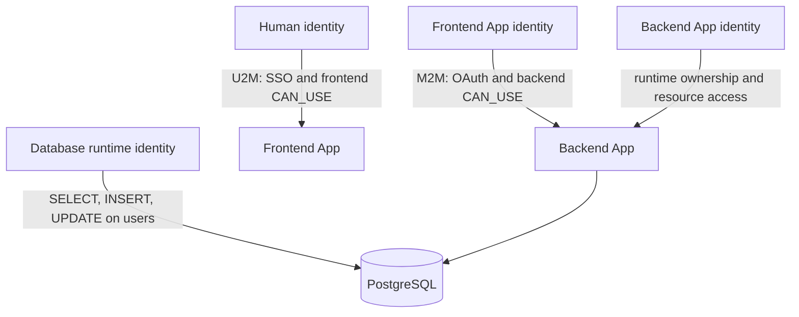
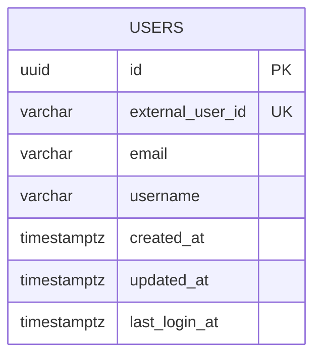
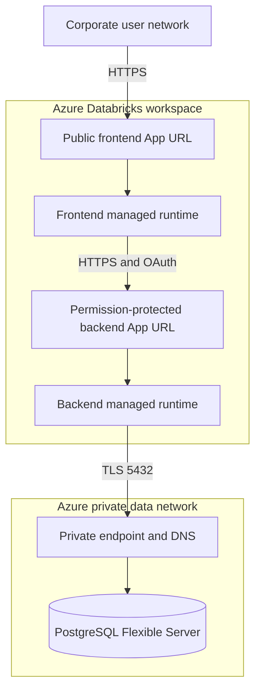

# High-level design: U2M split Databricks Apps

## 1. Purpose and scope

This document describes the system-level architecture for the U2M profile synchronization scenario in [`scenarios/u2m-postgres`](../../scenarios/u2m-postgres). It covers component boundaries, identities, trust zones, network paths, deployment topology, data ownership, security controls, availability and major design decisions.

Implementation details, request schemas and algorithms are in the companion [low-level design](lld.md). Deployment commands and operations are in the [implementation guide](../u2m-postgres.md).

## 2. Business outcome

An authenticated Azure Databricks user opens a custom React application. The application displays a safe profile and creates or updates one PostgreSQL user record. The frontend and backend run as separate Databricks Apps. The browser never receives backend topology, App credentials, database credentials or a delegated Databricks access token.

## 3. Architecture principles

- Databricks authenticates people; application code consumes gateway-established identity.
- Human U2M and service M2M are separate authentication hops.
- React talks only to its same-origin Backend-for-Frontend (BFF).
- The frontend App service principal, not the human's token, calls the backend App.
- Backend App access is denied unless the caller has `CAN_USE`.
- Human context is minimal, signed by the BFF and short-lived.
- `external_user_id` is the immutable database identity; email and username are attributes.
- Secrets are injected into server processes and never compiled into the SPA.
- Environment-specific configuration is declared once through the Databricks bundle.

## 4. System context

## 5. Container and component view

“Container” below means an independently deployed application boundary; Databricks Apps manages its runtime rather than accepting a user-managed Docker image.

### Component responsibilities

| Component | Responsibility | Explicitly does not do |
|---|---|---|
| Databricks frontend gateway | User sign-in, session enforcement, trusted identity headers, frontend `CAN_USE` | Persist application users |
| React SPA | Render loading, signed-in and error states; call relative `/api/me` | Parse identity headers, hold OAuth tokens, call PostgreSQL/backend directly |
| Node BFF | Read gateway identity, obtain App OAuth token, discover backend, sign context, serve SPA | Accept browser-supplied identity |
| Databricks backend gateway | Validate frontend App token and backend `CAN_USE` | Decide application-level profile fields |
| FastAPI | Verify signed context, validate schema, execute profile use case | Serve browser UI or enable permissive CORS |
| PostgreSQL | Enforce uniqueness and atomically persist the canonical user | Authenticate Databricks users |
| Databricks bundle | Define Apps, resource bindings, permissions and environment targets | Store secret values |

## 6. Identity and trust architecture

There are four identities with different purposes:

1. The human identity is established at the frontend gateway. Its stable ID is forwarded to the BFF.
2. Databricks creates a service principal for the frontend App. It receives `CAN_USE` on the backend through an App Resource and performs the server-to-server call.
3. The backend App has its own service principal for backend runtime resources. It is not shared with the frontend.
4. PostgreSQL uses a least-privilege runtime role contained in the backend-only connection secret.

The GitLab deployment service principal is a fifth operational identity. It can deploy the bundle but must not be reused as either runtime App identity.

## 7. Trust boundaries and controls

| Boundary | Threat | Primary controls |
|---|---|---|
| Browser → frontend gateway | Unauthenticated access and identity spoofing | Databricks SSO, frontend `CAN_USE`, gateway-owned forwarded headers |
| React → BFF | CSRF-like cross-origin use and topology leakage | Same-origin relative URLs, no browser credentials for backend, safe response schema |
| BFF → backend gateway | Unauthorized App invocation | Short-lived OAuth token, App Resource, target `CAN_USE`, `/api/*` endpoint |
| Gateway → FastAPI | Modified or replayed human context | HMAC over timestamp and exact body, constant-time check, 60-second window |
| FastAPI → PostgreSQL | Credential theft or over-privileged access | Backend-only secret binding, TLS, least-privilege database role, private networking |
| CI → workspace | Excessive deployment authority | Dedicated protected CI principal, masked variables, environment approvals |

Databricks gateway authorization is the security boundary for App-to-App access. The HMAC is defense in depth for the delegated human payload; it does not replace OAuth.

## 8. Data architecture

The backend owns the `users` table. No frontend component accesses it directly.

- `id` is the internal application identifier.
- `external_user_id` is stable, required and unique.
- `email` and `username` are nullable because identity-provider claims may be absent.
- Repeat and concurrent login events target the same row.
- Profile fields are operational identity data; retention, access logging and deletion must follow the organization's privacy policy.

## 9. Network and deployment topology

Production has two Databricks App URLs but only the frontend URL is intended for people. The backend gateway remains reachable only to principals explicitly granted access. PostgreSQL should use TLS and private Azure connectivity supported by the workspace network architecture.

No CORS allow-list is required for the supported browser path because browser traffic stays on the frontend origin. Vite's proxy is development-only. The production BFF is the proxy.

## 10. Availability, scaling and resilience

- Both Apps are stateless; Databricks may replace or scale their managed runtimes.
- OAuth tokens and the resolved backend URL are in-memory caches and can be rebuilt after restart.
- PostgreSQL is the system of record and should use production backups, zone redundancy and tested restore procedures as required by the workload tier.
- Atomic `ON CONFLICT` avoids duplicate-user races across multiple backend instances.
- Database connections use health checking and recycling.
- Backend failures return a generic 502 from the BFF; secrets and internal details stay out of browser responses.
- Retry policy should be bounded. A future retry of profile sync is safe because the operation is idempotent, but retries must use a fresh timestamp/signature.

## 11. Environment strategy

Development and production use different App names, secret scopes, PostgreSQL servers/roles and signing keys. Bundle targets select those references. Values remain outside Git.

| Concern | Development | Production |
|---|---|---|
| Bundle target | `dev` | `prod` |
| Secret scope | `once-upon-runtime-u2m-dev` | `once-upon-runtime-u2m-prod` |
| Database | Isolated non-production database | Managed production database |
| App permissions | Developer group | Approved user groups |
| Deployment | Manual U2M job after provisioning | Protected tagged/manual promotion |

## 12. Observability and audit

Log security-relevant outcomes with a request ID: identity missing, signature invalid/expired, OAuth/discovery failure, sync success and persistence failure. Never log authorization headers, access tokens, client secrets, signing keys, database URLs or full request bodies. Monitor App error rate/latency, OAuth failures, PostgreSQL connection saturation and upsert latency.

## 13. Key decisions and alternatives

| Decision | Reason | Rejected alternative |
|---|---|---|
| Node BFF in frontend App | Same-origin API and server-side App credentials | React calling backend directly, which adds CORS and browser OAuth complexity |
| M2M for profile sync | Backend authorizes the calling App; no user-token delegation required | Forwarding U2M access token without a user-authorized Databricks operation |
| HMAC context envelope | Binds server-derived human context to exact payload | Trusting browser JSON or unsigned internal headers |
| PostgreSQL UPSERT | Atomic under first-login concurrency | Read-then-insert/update race |
| Two Apps | Independent permissions and scaling | One runtime, which is simpler but has a larger shared failure/trust boundary |

## 14. Official references

- [Databricks Apps authentication](https://learn.microsoft.com/en-us/azure/databricks/dev-tools/databricks-apps/auth)
- [HTTP identity headers](https://learn.microsoft.com/en-us/azure/databricks/dev-tools/databricks-apps/http-headers)
- [App-to-App resources](https://learn.microsoft.com/en-us/azure/databricks/dev-tools/databricks-apps/apps-resource)
- [Databricks Apps permissions](https://learn.microsoft.com/en-us/azure/databricks/dev-tools/databricks-apps/permissions)
- [Databricks Apps networking](https://learn.microsoft.com/en-us/azure/databricks/dev-tools/databricks-apps/networking)
- [Azure Database for PostgreSQL security](https://learn.microsoft.com/en-us/azure/postgresql/flexible-server/security-overview)
