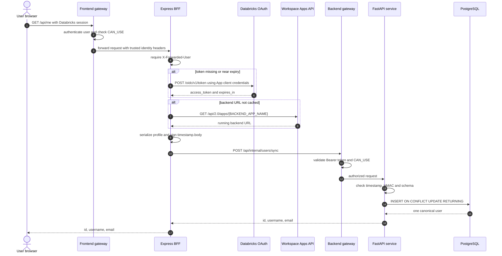
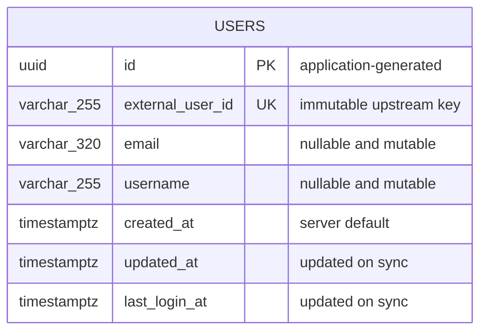
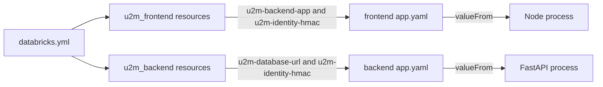

# Low-level design: U2M split Databricks Apps

## 1. Purpose

This document specifies the implementation of the U2M split-App profile flow: runtime processes, routes, trusted headers, internal protocol, OAuth and discovery, database schema/upsert, configuration mappings, error behavior and tests.

Read the [high-level design](hld.md) first for system boundaries and architectural decisions. Use the [implementation guide](../u2m-postgres.md) for provisioning and deployment commands. Use the [official U2M reference catalog](official-references.md) to trace each protocol and configuration decision to current Microsoft/Azure Databricks documentation.

## 2. Source layout

```text
scenarios/u2m-postgres/
├── frontend/
│   ├── app.yaml
│   ├── package.json
│   ├── server/
│   │   ├── backend-client.ts
│   │   ├── identity.ts
│   │   └── index.ts
│   └── src/
│       └── main.tsx
├── backend/
│   ├── app.yaml
│   ├── requirements.txt
│   ├── migrations/001_create_users.sql
│   └── app/
│       ├── config.py
│       ├── database.py
│       ├── main.py
│       ├── models.py
│       ├── schemas.py
│       ├── security.py
│       └── users.py
└── docker-compose.local.yml
```

## 3. Runtime processes

### Frontend App

Databricks builds the Vite SPA into `frontend/dist`. The App starts `npm run start`, which runs the Express server. Express:

1. registers `/api/health` and `/api/me`;
2. serves compiled files from `dist`;
3. serves `dist/index.html` for non-API dynamic routes;
4. listens on `DATABRICKS_APP_PORT` or local port 8000.

### Backend App

The App starts `uvicorn app.main:app`. FastAPI exposes only `/api/health` and `/api/internal/users/sync`. Interactive API documentation is disabled in this internal example.

## 4. Route contract and ordering

| Component | Method and route | Authentication | Response |
|---|---|---|---|
| Frontend | `GET /api/health` | Gateway policy | `{"status":"ok"}` |
| Frontend | `GET /api/me` | Human session and trusted identity header | Safe canonical profile |
| Frontend | `GET /{dynamic-path}` | Human session | React `index.html` |
| Backend | `GET /api/health` | Backend gateway policy | `{"status":"ok"}` |
| Backend | `POST /api/internal/users/sync` | App M2M at gateway plus valid HMAC envelope | Safe canonical profile |

API routes must be registered before the SPA fallback. Otherwise `/api/me` errors can be converted into HTTP 200 HTML, and deep links may return 404. The Express 5 fallback `/{*path}` handles paths such as `/projects/42`; static middleware handles `/` and assets first.

## 5. End-to-end sequence



## 6. Frontend identity adapter

`server/identity.ts` supports exactly two modes.

### `AUTH_MODE=databricks`

| Header | Mapping | Validation/use |
|---|---|---|
| `X-Forwarded-User` | `externalUserId` | Trimmed, required; missing produces frontend 401 |
| `X-Forwarded-Preferred-Username` | `username` | Trimmed, optional, display attribute |
| `X-Forwarded-Email` | `email` | Trimmed, optional, mutable attribute |

Only the server reads these headers. React cannot read or overwrite the gateway's trusted request context through application code.

### `AUTH_MODE=local`

The adapter reads fixed `LOCAL_USER_ID`, `LOCAL_USERNAME` and `LOCAL_EMAIL` values. It is allowed only when `NODE_ENV` is not `production`. Unknown modes throw. This prevents a misspelled or insecure production configuration from silently authenticating a local user.

## 7. Browser API behavior

React performs:

```typescript
fetch("/api/me", { credentials: "same-origin" })
```

There is no `VITE_BACKEND_URL`. The request therefore stays on the frontend origin and needs no production CORS policy or preflight. UI states are:

- loading while `/api/me` is pending;
- authenticated when the safe profile is returned;
- sign-in required for 401;
- generic profile-service failure for other errors.

The display name fallback order is username, email, then `Databricks user`.

## 8. OAuth token acquisition and App discovery

`server/backend-client.ts` reads the Databricks system environment variables only in the server process:

- `DATABRICKS_HOST`
- `DATABRICKS_CLIENT_ID`
- `DATABRICKS_CLIENT_SECRET`

It sends `grant_type=client_credentials&scope=all-apis` to `${DATABRICKS_HOST}/oidc/v1/token` using HTTP Basic client authentication. The token is cached until 60 seconds before expiry, with a minimum 30-second cache window. Token values are never logged or returned.

The resource binding injects `BACKEND_APP_NAME`. The BFF calls `GET /api/2.0/apps/{name}` with the App token, selects the running URL and caches it in memory. It does not hardcode environment URLs.

In local mode only, `LOCAL_BACKEND_URL` bypasses OAuth and discovery.

## 9. Signed internal user-context protocol

### Request

```http
POST /api/internal/users/sync
Authorization: Bearer <frontend-app-token>
Content-Type: application/json
X-Internal-Timestamp: 1786032000
X-Internal-Signature: sha256=<lowercase-hex-digest>
X-Request-ID: <uuid>

{"external_user_id":"stable-id","username":"Ada","email":"ada@example.com"}
```

The gateway consumes the bearer token for App authentication. FastAPI does not implement a second OAuth verifier; it runs behind the Databricks App gateway and verifies the application-level signed context.

### Signature algorithm

```text
body_bytes = exact UTF-8 bytes sent on the wire
message    = ascii(unix_timestamp) + "." + body_bytes
signature  = "sha256=" + hex(HMAC-SHA256(shared_secret, message))
```

The backend:

1. parses the timestamp as an integer;
2. rejects it if absolute clock difference exceeds 60 seconds;
3. computes HMAC over the untouched body bytes;
4. compares signatures with a constant-time function;
5. parses and validates JSON only after signature verification.

Altered body bytes, wrong keys, missing headers and stale envelopes return 401. A request ID is used for correlation but is not part of the authorization decision.

The short expiry limits replay exposure but does not provide a one-time nonce store. If strict single-use semantics become necessary, persist request IDs for the signature window in a shared low-latency store.

## 10. Input and response schemas

### `UserSync`

| Field | Type | Constraint |
|---|---|---|
| `external_user_id` | string | Required, trimmed, 1–255 characters, no control characters |
| `username` | string/null | Trimmed, maximum 255, no control characters |
| `email` | string/null | Trimmed, maximum 320, no control characters |

An empty optional string normalizes to `null`. The current example length-validates email but does not require RFC email syntax because upstream identity providers may emit non-standard enterprise identifiers.

### `UserView`

```json
{
  "id": "8b78e2bf-1eef-4f97-b8b3-73577126615e",
  "username": "Ada",
  "email": "ada@example.com"
}
```

No database URL, token, service-principal identifier, HMAC metadata or timestamps are returned to React.

## 11. Database design and algorithm



The repository executes one PostgreSQL statement:

```sql
INSERT INTO users (...)
VALUES (...)
ON CONFLICT (external_user_id)
DO UPDATE SET
  email = EXCLUDED.email,
  username = EXCLUDED.username,
  updated_at = EXCLUDED.updated_at,
  last_login_at = EXCLUDED.last_login_at
RETURNING ...;
```

This provides the following behavior:

| Case | Result |
|---|---|
| First login | New UUID and row |
| Repeat login with same attributes | Same row returned; login/update timestamps advance |
| Changed email or username | Same row updated |
| Concurrent first login | Unique index arbitrates; both calls return the same logical row |
| Database error | Session rolls back and API returns 503 |

`pool_pre_ping=True` rejects stale pooled connections and `pool_recycle=300` periodically renews them.

## 12. Configuration mapping

### Bundle resources



| Bundle/App resource name | App receiving it | `app.yaml` variable |
|---|---|---|
| `u2m-backend-app` | Frontend | `BACKEND_APP_NAME` |
| `u2m-identity-hmac` | Frontend | `INTERNAL_IDENTITY_HMAC_SECRET` |
| `u2m-database-url` | Backend | `DATABASE_URL` |
| `u2m-identity-hmac` | Backend | `INTERNAL_IDENTITY_HMAC_SECRET` |

Resource names in `valueFrom` are identifiers, not secret values. Databricks resolves them only for the App that received the resource binding.

## 13. Error contract

| Failure | Owner | External status | Browser-visible detail |
|---|---|---:|---|
| Missing human identity header | BFF | 401 | Sign-in required |
| Unsupported/insecure auth mode | BFF | 502 | Profile service unavailable |
| OAuth or App discovery failure | BFF | 502 | Profile service unavailable |
| Backend gateway denies App | Backend gateway/BFF | 502 from BFF | Profile service unavailable |
| Missing/invalid/expired HMAC | FastAPI | 401 | Hidden by BFF generic failure |
| Invalid profile schema | FastAPI | 422 | Hidden by BFF generic failure |
| PostgreSQL failure | FastAPI | 503 | Hidden by BFF generic failure |

Logs include outcome and request ID. They exclude authorization values, secrets, connection strings and request bodies.

## 14. CORS, proxy and dynamic-route rules

Production does not enable backend CORS because the browser never calls the backend origin. The supported route is:

```text
browser → frontend-origin /api/me → BFF → backend App
```

For local Vite development only, `vite.config.ts` proxies `/api` to Express on `127.0.0.1:8000`. This proxy must not be confused with the production BFF.

Route precedence is:

1. explicit `/api/health` and `/api/me`;
2. compiled static assets;
3. SPA fallback for non-API paths.

If more APIs are added, register them before the fallback and retain the `/api/` prefix required for Databricks App API endpoints.

## 15. Test design

### Automated now

- Gateway headers map to the expected trusted identity.
- Missing stable identity fails closed.
- Local authentication is forbidden in production.
- A correctly signed request is accepted.
- A missing signature is rejected.
- TypeScript strict typecheck, Vite build, Ruff, Python compilation and dependency audit run in CI.

### PostgreSQL integration suite to run against an ephemeral database

| Test | Assertion |
|---|---|
| First sync | One row created with safe response |
| Repeat sync | Row count remains one and UUID is unchanged |
| Attribute update | Email/username and timestamps update |
| Concurrent first sync | All calls succeed against one unique row |
| Invalid external ID | 422 and no row |
| Database failure | Transaction rolled back and 503 |
| Altered signed body | 401 before schema/database work |
| Unauthorized service principal | Databricks gateway denies before FastAPI |

Use the local Compose PostgreSQL for developer integration tests. CI should provision an ephemeral PostgreSQL service before promoting this scenario to an automatic production gate.

## 16. Deployment order

1. Provision PostgreSQL networking, database, migration owner and runtime role.
2. Execute `001_create_users.sql` using the migration identity.
3. Create the environment-specific backend-only database scope and shared signing-only scope, then populate their values.
4. Validate and deploy the bundle.
5. Start/deploy the backend App first.
6. Start/deploy the frontend App.
7. Grant people/groups `CAN_USE` on the frontend only.
8. Run positive, negative, dynamic-route and concurrency smoke tests.

## 17. Official references

The full categorized bibliography, U2M-versus-M2M applicability guidance and evidence-to-code mapping is in **[Official references: Databricks Apps U2M and App-to-App authentication](official-references.md)**.

- [Databricks Apps runtime and `app.yaml`](https://learn.microsoft.com/en-us/azure/databricks/dev-tools/databricks-apps/app-runtime)
- [Databricks Apps system environment](https://learn.microsoft.com/en-us/azure/databricks/dev-tools/databricks-apps/system-env)
- [App-to-App resources](https://learn.microsoft.com/en-us/azure/databricks/dev-tools/databricks-apps/apps-resource)
- [HTTP identity headers](https://learn.microsoft.com/en-us/azure/databricks/dev-tools/databricks-apps/http-headers)
- [Manage Apps with Declarative Automation Bundles](https://learn.microsoft.com/en-us/azure/databricks/dev-tools/bundles/apps-tutorial)
